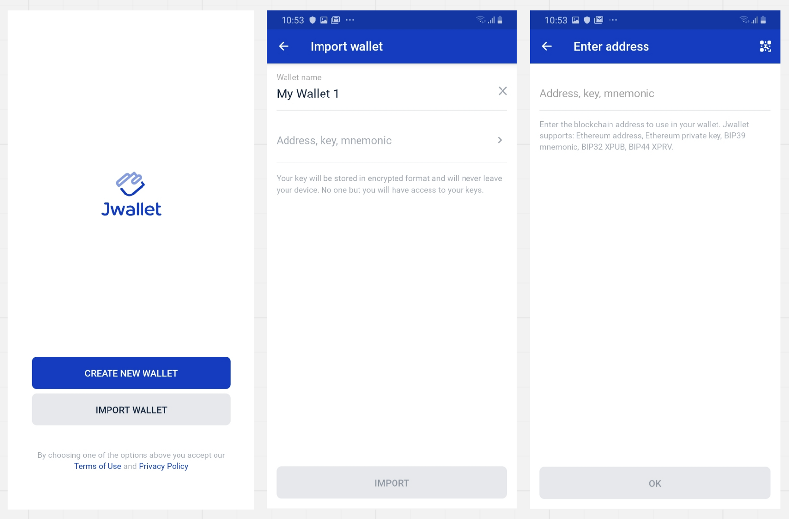

[[toc]]

Storing Ethereum (ETH) and other cryptocurrencies safely and securely is critical. No matter what cryptocurrency wallet you use to store Ethereum or other ERC20 tokens, you must always keep all wallet information in several secure physical/digital locations to prevent loss of access or theft. Mobile wallets, like [Jwallet](https://jibrel.page.link/hts), are currently one of the most popular options for managing Ethereum and ERC20 tokens like Ethereum (ETH). They require minimal data to be downloaded to connect to the network and make your Ethereum (ETH) tokens easily accessible through your smartphone. You can store Ethereum (ETH) in the [Jwallet (on iOS, Android, and Web)](https://jibrel.page.link/hts) by following the simple steps outlined below.

## Creating a New Wallet

Creating a new wallet takes seconds. To create your first wallet simply:

- Create a secure pin
- Tap **Create New Wallet** button on the bottom of the screen
- Name your wallet, hit **Create,** and you’re good to go

## Importing an Existing Wallet

To import an existing wallet into your Jwallet:

- Tap **Import Wallet**
- Name your wallet and tap on the **Address, Key, Mnemonic** box and hit **Import**
- Enter your details and tap **Ok**

You should see your imported wallet instantly with all of your assets. If you import multiple wallets, you should be able to see all of them on the **My Wallets** screen.

## Backing Up Your Wallet

After creating your wallet name and passcode, it is important to back up your new wallet by generating and saving your **mnemonic** phrase. A mnemonic is a multi-word key that is created to add an extra layer of security to your Ethereum (ETH) wallet. This mnemonic phrase can be used to import your key into other wallets or restore your wallet in the future. Keep your mnemonic safe & never share it with anyone! To create one:

- Tap on the **Back Up Wallet** button on the bottom of the screen
- Check the two **checkboxes** to confirm that you understand the terms and tap **Continue**
- Copy your mnemonic phrase, store it in a safe place, and tap **Done**

## To Backup an Existing Wallet

Remember, your mnemonic phrase and private key are the only ways to restore access to your funds! To backup an existing Ethereum (ETH) wallet:

- Tap the icon in the top right corner of the home screen to go the **My Wallets** view
- Tap on the **three dots** on the right side of your wallet’s name to access the menu
- Tap the last option called **Backup Wallet** and proceed through the backup process described above

## Receiving Ethereum (ETH)

To receive Ethereum (ETH) or other ERC20 tokens:

- Tap the **Receive** button located on the top left side of the home screen
- Hit the **Copy Address** or **Share** buttons and paste your Ethereum (ETH) address into wherever you are transferring Ethereum (ETH) tokens from

## Sending Ethereum (ETH)

To send Ethereum (ETH)  or other ERC20 tokens using the Jwallet:

- Tapthe **Send** button located on the top right side of the home screen
- Specify the **Recipient Address** to which you are sending Ethereum (ETH)
- Specify the **Amount** of Ethereum (ETH) you would like to send
- Hit **Send** to complete the transaction and transfer Ethereum (ETH)

