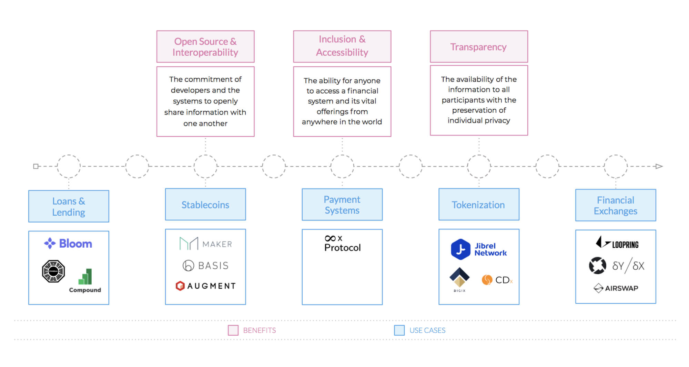

DeFi (Decentralized Finance, 탈중앙화된 금융) — 블록체인과 같은 오픈 소스의 탈중앙화된 소프트웨어가 전통적인 금융 세계, 서비스 및 애플리케이션을 변화시킬 수 있다는 아이디어입니다.

[[toc]]

아마도 가장 널리 사용되는 DeFi 애플리케이션은 [Bitcoin](https://www.coindesk.com/information/what-is-bitcoin)입니다. 전 세계에 분산되어 있는 거대한 채굴 네트워크는 비트코인 네트워크가 작동할 수 있도록 컴퓨팅 성능을 제공합니다. Bitcoin은 가상 결제, 송금 시스템 및 통화 단위로의 기능에만 제한적이지만 후속적인 [Ethereum](https://blockgeeks.com/guides/ethereum/) 개발 및 스마트 계약 기술로 인해 가능성의 영역을 크게 확장했습니다. 이 차세대 핀테크는 역사적으로 중앙 집중화되고 폐쇄적인 시스템을 탈중앙화하고 민주화하려고 합니다.

## DeFi의 이점은 무엇인가요?

DeFi의 주요 목표는 탈중앙적이고 검열이 없는 제품을 개발할 수 있는 통합적인 허가가 필요없는 은행 및 통화 시스템을 만드는 것입니다. 이 시스템에 구축되는 탈중앙화된 애플리케이션을 [DApps](https://blockchainhub.net/decentralized-applications-dapps/)라고 합니다. 중앙 서버에서 실행하는 대신 중앙 장애 지점이 없는 P2P 네트워크에서 실행됩니다. 이것은 Uber, Netflix, YouTube 및 모든 소셜 미디어 플랫폼과 같이 우리 대부분이 매일 사용하는 중앙 집중식 애플리케이션과는 상당히 다릅니다. 이러한 애플리케이션은 다음과 같은 세 가지 주요 원칙을 염두에 두고 개발되었습니다.

**오픈 소스 및 상호 운용성:** 소프트웨어 개발자와 그들이 만든 시스템은 서로 정보를 공개적으로 공유합니다.

**포용성 및 접근성:** 금융 시스템과 그 필수 상품(예: 모기지, 보험 및 기업 대출)에 대한 전세계 모든 이들의 접근을 가능하게 합니다. 오늘날에도 여전히 17억명이 넘는 사람들이 은행 서비스를 받지 못하는 가운데, 이러한 애플리케이션이 수십년 동안 사람들을 괴롭혀온 장벽을 제거함으로써 지구에 극적인 영향을 미칠 수 있습니다.

**투명성:** 개인 정보 보호에 중점을 두는 모든 참가자에게 동일한 정보의 이용 가능성을 제공합니다. DeFi 시스템에서 정부와 기관은 그들이 일하는 대상이 되는 사람들의 정보를 제한하거나 오도하거나 검열하거나 또는 침묵시킬 수 없습니다.

## DeFi 애플리케이션은 무엇에 사용되나요?

탈중앙화 금융 애플리케이션의 잠재력을 전부 발휘하기에는 여전히 몇 년의 시간이 소요되겠지만 오늘날에도 이미 사용되고 있는 다양한 애플리케이션이 있습니다. 제3세계 국가에서 DApp은 대출 및 결제와 같은 보다 생활에 필수적인 기능을 제공하려고 합니다. 완벽하게 기능하는 은행 시스템을 갖춘 선진국에서는 탈중앙화 애플리케이션이 주로 트레이딩, 투자, 게임 및 도박에 사용됩니다. 현재 가장 주된 사용 사례는 다음과 같습니다.

**대출 및 대부:** 전통적인 대출에서는 돈을 빌리기 위해 개별적으로 은행에 갈 것을 요구하지만, 탈중앙화된 금융 애플리케이션은 채무자가 더 넓은 범위의 채권자를 활용할 수 있게 합니다.

**스테이블코인:** 이는 시장의 변동성에 대한 보호를 제공하는 디지털 자산입니다. 이는 미국 달러와 같은 기초 자산에 고정되어 있으며 트레이더와 투자자는 암호화폐 거래시 일시적이고 안정적으로 가치와 화폐 단위를 저장할 수 있습니다.

**결제 시스템:** Bitcoin과 같은 애플리케이션은 거래, 저장 등을 용이하게 하는 데 사용되는 자체 디지털 코인 또는 토큰을 가지고 있습니다.

**토큰화:** [상품](https://medium.com/jibrel-network/jcom-commodities-on-chain-bbc8e9aa03a8), [부동산](https://medium.com/jibrel-network/how-jibrel-is-tokenizing-real-estate-a2db513666c2), [예술품](https://medium.com/jibrel-network/7-ways-security-tokens-will-change-the-world-fbf8afee038e) 등과 같은 실물 자산을 블록체인에 배치하는 것을 말합니다. 이러한 프로세스를 통해 물리적이고 분할할 수 없는 자산에 대한 일부 소유권의 편익을 얻는 동시에 이러한 산업과 관련된 많은 오버헤드, 규정 준수 비용 및 중개인 비용을 제거할 수 있습니다.

**금융 거래소:** [탈중앙화 거래소](https://cryptocurrencyfacts.com/what-is-a-dex/)는 사용자가 개인키를 이용해 자금을 보유하고 있는 플랫폼에서 자산을 P2P로 거래할 수 있습니다. 이는 해킹 및 [기타 문제](https://www.coindesk.com/bitfinex-ny-prosecutors-tether-850-million-allege)가 지속적으로 발생하는 중앙 집중식 거래소와 완전히 대조적입니다.

## DeFi 애플리케이션의 예는 무엇이 있나요?

2017년의 시장 호황 이후 시간 테스트를 견뎌낸 프로젝트들은 단순한 백서 개념과 투기적인 꿈으로부터 현재는 실제 운용가능한 애플리케이션으로 발전했습니다. 아래는 블록체인 및 암호화폐 업계에서 가장 눈에 띄는 프로젝트의 예 중 일부입니다.

**[MakerDAO](https://makerdao.com/en/)**: Dai 스테이블 코인과 같은 암호화폐로 담보화된 자산을 허용하는 탈중앙화 암호화폐.

**[Lightning Network](https://en.wikipedia.org/wiki/Lightning_Network)** : 비트코인의 블록체인 위에 구축된 보조 레이어. 가장 유망한 애플리케이션 중 하나인 라이트닝 네트워크는 Bitcoin 네트워크에서 저렴한 수수료로 더 빠른 거래를 할 수 있도록 만들어졌습니다. 최근 몇 개월 동안 네트워크 용량이 [천만달러](https://1ml.com/statistics) 이상으로 크게 증가했습니다.

**[Augur](https://www.augur.net/)**: Ethereum 네트워크에서 운영되는 탈중앙화 예측 시장. 이 플랫폼에서 베팅이 가능한 대상은 사실상 무한하며 정치적 사건부터 일기 예보에 이르는 모든 것을 포함합니다.

**[Compound](https://compound.finance/)**: 암호화 자산을 위한 탈중앙화 대출 시장 여기서는 더 유리한 조건, 즉각적인 유동성 및 "채무자가 원하는 속도의" 대출금 상환을 제공한다고 주장합니다.

**[dy/dx](https://dydx.exchange/)**: Ethereum 블록체인 위에 구축된 탈중앙화 거래 플랫폼으로 마진 및 레버리지 거래가 가능합니다.

**[암호화폐 월렛](https://jwallet.network/)**: 인터넷에 연결된 사람이라면 누구나 주어진 블록체인 네트워크에 액세스할 수 있는 탈중앙화 애플리케이션입니다. 예를 들어, Ethereum 및 ERC20 월렛 ([예 : Jwallet](https://jwallet.network/))을 사용하면 누구나 Ethereum 및 ERC-20 토큰을 안전하게 거래하고 보관할 수 있습니다.

**[bZx](https://b0x.network/)**: 마진 거래를 위한 분산 플랫폼. 이 회사는 토큰화 된 마진 대출을 사용하는 유동성 풀을 활용하여 암호화폐 시장에 더 큰 유동성을 제공하려고 합니다.

**[CDx](https://cdxproject.com/)**: 토큰화 된 CDS (신용부도스와프)를 위한 탈중앙화 프로토콜. 투자자는 환리스크를 헷지하고 해킹에 대비하며 안전하게 거래할 수 있습니다.

**[Uniswap](https://uniswap.io/)**: Ethereum 및 ERC20 토큰 거래를 위한 탈중앙화 프로토콜

**[8x 프로토콜](https://8xprotocol.com/)**: 기업의 급여처리, 세무 및 보고를 지원하는 탈중앙화 구독 결제 플랫폼

**[0x](https://0x.org/) 및 [Loopring](https://loopring.org/)**: DEX (탈중앙화 거래소)의 개발을 허용.

**[Augmint](https://www.augmint.org/)**: 유로화로 담보되고 1:1로 가치가 고정된 스테이블코인.

**[Dharma](https://www.dharma.io/)**: 토큰화 된 부채 기반 대출을 가능하게 하는 탈중앙화 애플리케이션.

**[Digix](https://digix.global/)**: Ethereum 네트워크에서 DGX 토큰을 사용하여 토큰화 된 금을 디지털로 표현한 것으로, 여기서 1 DGX는 1그램의 금을 나타냅니다.

**[Bloom](https://bloom.co/)**: Ethereum 기반 탈중앙화 신용 평가 및 검증 프로토콜

**[Airswap](https://www.airswap.io/)**: Ethereum 위에 구축된 탈중앙화 P2P 거래 플랫폼

궁극적으로 DeFi는 오늘날 우리가 알고 있는 많은 서비스를 보다 저렴하고 빠르며 효율적으로 만들고 있습니다. 중개자 및 관료주의를 차단하기 위해 분산 기술을 활용함으로써 이러한 금융 애플리케이션은 금융 시스템에 대한 액세스를 확대하고 있습니다. 결국 DApps는 이전에는 제외되는 것이 당연하게 여겨졌던 수십억명의 사람들에게 필수 금융 서비스에 액세스하는 것을 가능하게 할 것입니다. 하지만 여전히 많은 합의 기반 애플리케이션들은 종종 그것을 만든 이들이 우리로 하여금 믿기를 바라는 것만큼 투명하지 않은 중앙 집중화된 요소들을 가지고 있습니다. 성장통이 지속되기는 하지만, 저희의 개발이 나아갈 곳이 어딘지를 보는 것은 흥미진진하고 지브렐이 그러한 유망한 미래에 참여하게 되어 기쁩니다!
