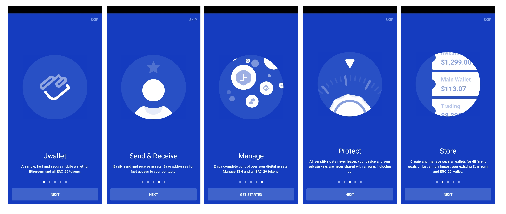
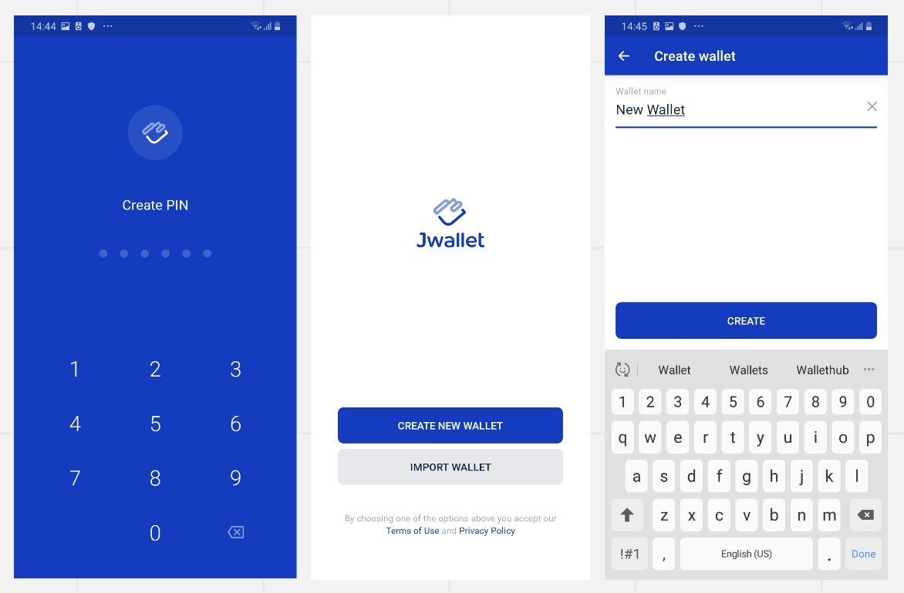
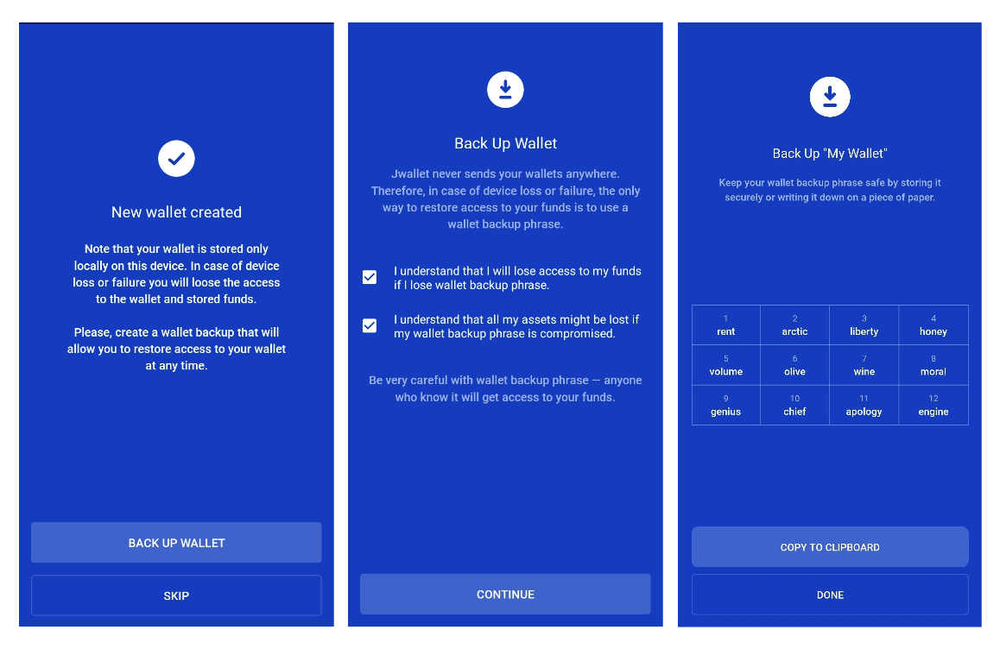
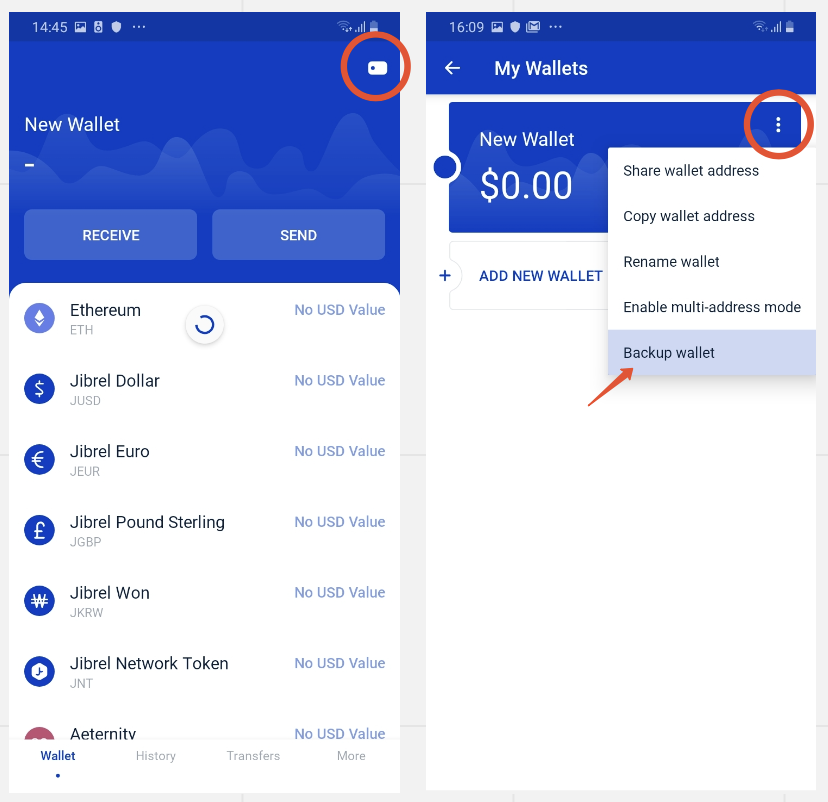
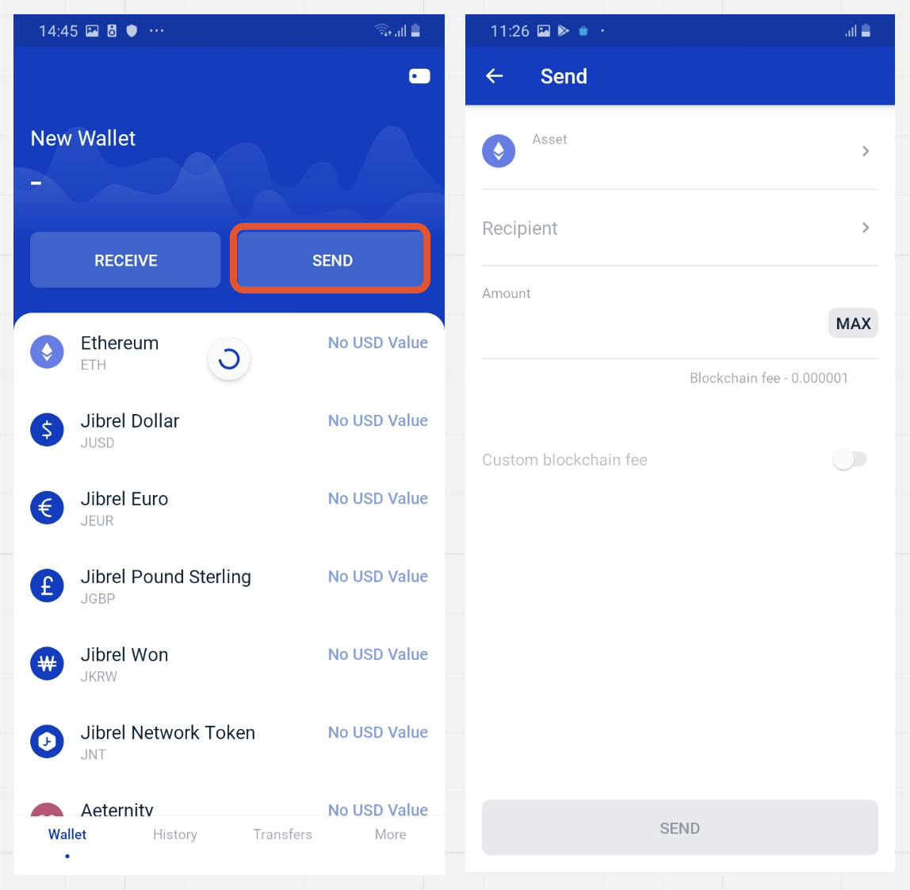

[[toc]]

安全地存储以太坊（ETH）和其他加密货币至关重要。无论您使用哪种加密货币钱包存储以太坊或其他ERC20代币，都必须始终将所有钱包信息保存在几个安全的物理/数字位置，以防止访问或盗窃。像Jwallet这样的移动钱包，目前是管理以太坊和以太坊（ETH）等ERC20代币的最受欢迎的选择之一。他们需要下载最少的数据才能连接到网络，并使您的以太坊（ETH）令牌可通过智能手机轻松访问。您可以按照以下概述的简单步骤将以太坊（ETH）存储在[Jwallet中（在iOS，Android和Web上）](https://jwallet.network/)

## 创建一个新钱包

创建新钱包需要几秒钟。只需创建您的第一个钱包：

- 创建一个安全的密码
- 点击屏幕底部的**创建新钱包**按钮
- 为您的钱包命名，点击 **“创建”，** 一切顺利

## 导入现有的钱包

要将现有的钱包导入到您的Jwallet中：

- 点击 **导入钱包**
- 为您的钱包命名，然后点击“ **地址，密钥，助记符”**框，然后点击**“导入“**
- 输入您的详细信息，然后点击 **确定**

您应该立即看到所有资产的进口钱包。如果您导入多个钱包，则应该可以在“ **我的钱包”**屏幕上看到所有 **钱包**。

## 备份钱包

创建钱包名称和密码后，通过生成并保存**助记** 词短语来备份新钱包非常重要 。助记符是一种多字密钥，旨在为您的以太坊（ETH）钱包添加额外的安全保护。此助记词可用于将您的密钥导入其他钱包或将来恢复您的钱包。确保您的助记符安全，切勿与任何人共享！创建一个：

- 点击 屏幕底部的“ **备份钱包”**按钮
- 选中两个 **复选框**以确认您了解条款，然后点击**继续**
- 复制助记词短语，将其存储在安全的地方，然后点击 **“完成”**

## 备份现有钱包

请记住，您的助记词和私钥是恢复对资金的访问的唯一方法！要备份现有的以太坊（ETH）钱包：

- 点按主屏幕右上角的图标，进入“ **我的钱包”**视图
- **点按** 钱包名称右侧的 **三个点** 以访问菜单
- 点击最后一个名为“ **备份钱包**”的选项，  然后继续执行上述备份过程

## 接收以太坊（ETH）

接收以太坊（ETH）或其他ERC20令牌：

- 点击主屏幕左上方的**接收**按钮
- 点击 **"复制地址"或"共享"** 按钮，然后将您的以太坊（ETH）地址粘贴到要从中转移以太坊（ETH）令牌的任何位置

## 发送以太坊（ETH）

使用Jwallet发送以太坊（ETH）或其他ERC20令牌：

- 点击 主屏幕右上角的 **发送** 按钮
- 指定 您要向其发送以太坊（ETH）的**收件人地址**
- 指定您要发送的以太坊（ETH）**金额**
- 点击**发送**以完成交易并转移以太坊（ETH）

